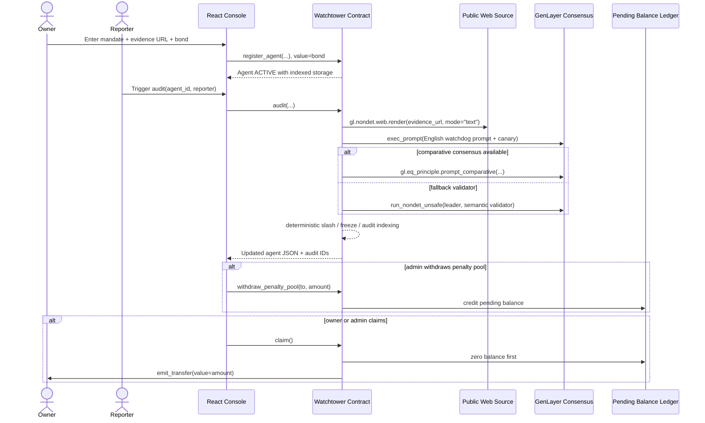
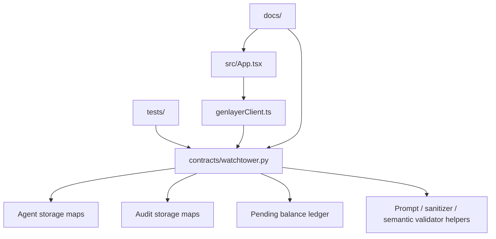
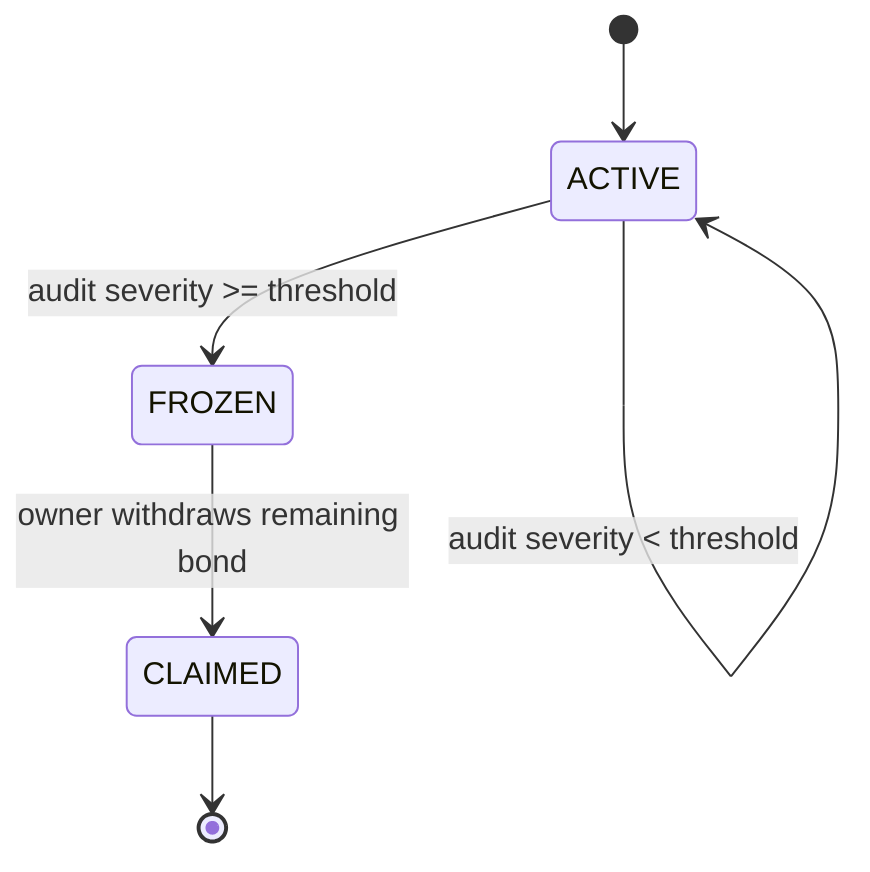

# Watchtower Architecture

Watchtower is a GenLayer intelligent contract plus a Vite/React operator console. Milestone 1 established the contract safety baseline, and Milestone 6 documents the current shape so the later AI, appeals, categories, and multi-token releases have a stable reference.

## End-to-End Sequence

## Component Map

## Storage Groups

- Agents: owner, mandate, evidence URL, native bond, status, registration time, last audit time, audit count, audit index slots.
- Audits: global audit counter plus agent, reporter address, reporter label, verdict, severity, slashed amount, reasoning, canary, recorded time.
- Balances: contract-held penalty pool and per-address pending claim balances.
- Config: admin address, violation threshold, minimum audit interval.

## Current State Machine

Future milestones extend this machine with `NEEDS_REVIEW`, `PROBATION`, and appeal transitions.
