# Watchtower: Fiduciary Watchdog for Autonomous AI Agents

**Watchtower** là một ứng dụng phi tập trung (dApp) chạy dưới dạng **Intelligent Contract** trên mạng lưới **GenLayer**. Nó đóng vai trò làm kiểm toán viên giám hộ (fiduciary watchdog) để kiểm soát, giám sát và thực thi trách nhiệm pháp lý/tài chính đối với các AI Agent tự hành đang nắm giữ tài sản hoặc tự quản lý quỹ của con người.

Dự án được viết hoàn toàn bằng **Python** và tương thích hoàn toàn với môi trường chạy **GenVM v0.2.16**.

---

## 💡 Ý tưởng cốt lõi & Sự khác biệt

Các hợp đồng thông minh truyền thống trên EVM (như Solidity) bị giới hạn trong môi trường hoàn toàn khép kín và mang tính xác định cao (deterministic). Chúng không thể:
1. Đọc dữ liệu phi cấu trúc trực tiếp từ thế giới web bên ngoài mà không thông qua Oracle tập trung phức tạp.
2. Đưa ra các quyết định mang tính "phán đoán chủ quan" (ví dụ: đánh giá xem một chuỗi hành động của AI Agent có đang đi lệch hay vi phạm cam kết ủy thác ban đầu hay không).

**Watchtower trên GenLayer giải quyết triệt để bài toán này**:
* Hợp đồng cho phép chủ sở hữu AI Agent đăng ký agent kèm theo một bản **ủy thác tự nhiên (mandate)** mô tả quyền hạn và nghĩa vụ của Agent bằng ngôn ngữ tự nhiên (Ví dụ: Tiếng Anh hoặc Tiếng Việt) cùng một khoản **tiền đặt cọc (bond)**.
* Khi bất kỳ ai kích hoạt một cuộc kiểm toán (`audit`), hợp đồng sử dụng tính năng cào web phi tập trung của GenVM (`gl.nondet.web.render`) để lấy lịch sử hoạt động công khai gần nhất của agent từ internet.
* Sau đó, hợp đồng sử dụng mô hình ngôn ngữ lớn (LLM) tích hợp sâu trong nhân GenVM thông qua API (`gl.nondet.exec_prompt`) để phân tích và phán đoán xem các hành động đó có nằm trong phạm vi mandate của nó hay không.
* Nếu phát hiện vi phạm nghiêm trọng vượt ngưỡng quy định, hợp đồng sẽ **đóng băng (FROZEN) trạng thái hoạt động của Agent** và tự động **slash (tịch thu) một tỷ lệ tiền cọc (bond)** đưa vào Penalty Pool.

---

## 🏗️ Kiến trúc & Luồng hoạt động

```mermaid
sequenceDiagram
    actor Owner
    actor Watcher as Public Watcher
    participant Contract as Watchtower Contract
    participant Web as Public Log (Web)
    participant LLM as GenVM LLM Consensus

    Owner->>Contract: register_agent(agent_id, mandate, evidence_url, bond)
    Note over Contract: Agent is ACTIVE<br/>Bond is locked
    
    Watcher->>Contract: audit(agent_id, reporter)
    
    rect rgb(30, 30, 45)
        Note over Contract, LLM: Non-deterministic consensus phase (Leader/Validator)
        Contract->>Web: gl.nondet.web.render(evidence_url)
        Web-->>Contract: Logs/Behavior feeds
        Contract->>LLM: gl.nondet.exec_prompt(mandate vs behavior)
        LLM-->>Contract: JSON Verdict {"verdict", "severity", "slash_ratio"}
    end

    Note over Contract: Deterministic State Update
    alt Severity >= Threshold (60)
        Note over Contract: Change Status to FROZEN
        Note over Contract: Slashed bond calculated & sent to Penalty Pool
    else Compliant / Low Severity
        Note over Contract: Append audit report<br/>Keep active status
    end
    Contract-->>Watcher: Return updated Agent State (JSON)
```



---

## 📁 Cấu trúc thư mục

```
Watchtower/
├── contracts/
│   ├── watchtower.py         # Intelligent Contract chính của Watchtower
│   └── storage_test.py       # Contract sanity-check tối giản để test môi trường
├── docs/
│   ├── GENLAYER_RULES.md     # Bản chép nguyên văn 7 Rules + R13 của GenVM
│   └── DEPLOY.md             # Quy trình chi tiết để deploy lên GenLayer Studio
├── examples/
│   └── sample_audit.md       # Dữ liệu Agent mẫu và kịch bản test 2 chiều sạch/vi phạm
└── README.md                 # Tài liệu hướng dẫn chính
```

---

## 🚀 Triển khai & Kiểm thử nhanh

### 1. Triển khai
Môi trường chính thức để chạy các Intelligent Contracts này là **GenLayer Studio** (không cần chạy node local):
* Truy cập: [https://studio.genlayer.com/run-debug](https://studio.genlayer.com/run-debug)
* Thực hiện reset bộ nhớ và hard-refresh theo hướng dẫn trong [DEPLOY.md](file:///Users/ai/bot AI/Watchtower/docs/DEPLOY.md).
* Deploy [storage_test.py](file:///Users/ai/bot AI/Watchtower/contracts/storage_test.py) để kiểm tra tính năng lưu trữ cơ bản hoạt động ổn định.
* Deploy [watchtower.py](file:///Users/ai/bot AI/Watchtower/contracts/watchtower.py) để chạy ứng dụng chính.

### 2. Kịch bản chạy thử
Hãy theo dõi [sample_audit.md](file:///Users/ai/bot AI/Watchtower/examples/sample_audit.md) để:
* Chuẩn bị URL chứa logs của Agent thông qua GitHub Gist.
* Thực hiện đăng ký, nạp tiền cọc, và thực thi các cuộc kiểm toán tự động.
* Xem cách LLM trên chuỗi phân định giữa hành vi sạch và hành vi vi phạm thỏa thuận ủy thác.

---

## ⚠️ Ràng buộc phát triển (GenVM Constraints)

Khi thực hiện chỉnh sửa hoặc nâng cấp mã nguồn Python trong dự án này, luôn ghi nhớ các quy tắc bất biến của GenVM (xem thêm chi tiết tại [GENLAYER_RULES.md](file:///Users/ai/bot AI/Watchtower/docs/GENLAYER_RULES.md)):
1. Dòng đầu tiên phải luôn khai báo phiên bản: `# v0.2.16`.
2. Không khởi tạo các biến storage dạng `TreeMap()` hay `DynArray()` trực tiếp trong `__init__`.
3. Không sử dụng kiểu dữ liệu số thực `float` trong bất kỳ tham số hay kiểu trả về của các method công khai (`@gl.public`).
4. Chỉ được import bằng cú pháp duy nhất: `from genlayer import *`. Không re-import module `genlayer` để tránh lỗi đè namespace.
5. Mọi hành động cào web và gọi prompt (`gl.nondet.*`) phải nằm trọn vẹn trong phương thức `gl.vm.run_nondet_unsafe()`. Mọi phép tính toán trừ tiền hay thay đổi trạng thái phải được chạy ở phần code deterministic bên ngoài.
