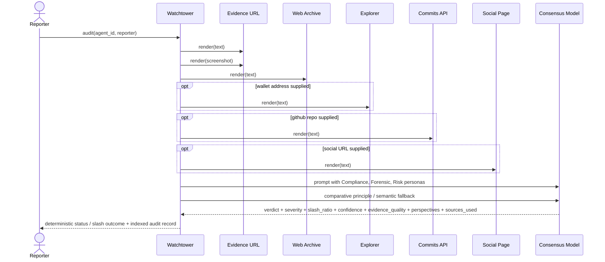

# AI Consensus Flow

Milestone 2 upgrades Watchtower from a single-source prompt into a richer evidence pack with multiple personas and richer audit metadata.

## Stored Audit Metadata

- verdict
- severity
- slash ratio result
- confidence
- evidence quality
- three perspective summaries
- source URLs used
- deterministic canary
