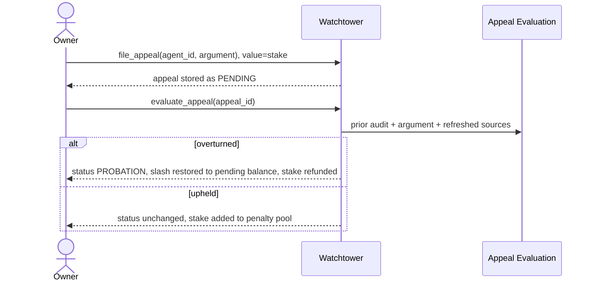

# Appeal Flow

```mermaid
sequenceDiagram
    actor Owner
    participant Contract as Watchtower
    participant Model as Appeal Evaluation

    Owner->>Contract: file_appeal(agent_id, argument), value=stake
    Contract-->>Owner: appeal stored as PENDING
    Owner->>Contract: evaluate_appeal(appeal_id)
    Contract->>Model: prior audit + argument + refreshed sources
    alt overturned
        Contract-->>Owner: status PROBATION, slash restored to pending balance, stake refunded
    else upheld
        Contract-->>Owner: status unchanged, stake added to penalty pool
    end
```
